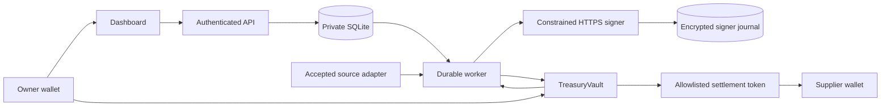

# Architecture

The Next.js EIP-1193 wallet dashboard talks to the Hono API. Authenticated owner sessions create bounded EIP-712 obligations in SQLite. An independent worker schedules due work, reads live vault policy and accepted source evidence, reserves daily exposure, persists a quote and exact prepared request, asks a constrained signer for bytes, journals those bytes before broadcast, then reconciles actual chain events. The contract independently enforces every spend boundary.

Owner custody remains separate from executor gas. Owner wallet controls funding, withdrawal, token/recipient allowlists, source age, epoch, executor rotation, pause and cancellation. API preparation returns exact attributed transactions; the wallet sends them and the API verifies their chain effects. The worker receives only executor signing credentials. Oracle publisher and deployer use separate role wallets/services for remote modes.

`packages/core/adapters.ts` defines treasury-domain extension boundaries for market observations, JACK-inspired tasks/executors and submission/reconciliation. The production worker supplies the durable financial state machine independently; no repository TicketState/worktree executor or unlicensed JACK source is reused. A future licensed JACK adapter can replace the boundary without changing merchant spend authority.

SQLite WAL is single-host, with versioned migrations, optimistic transitions, scoped idempotency, reservations, exact prepared requests, multiple attempts with one active nonce route, sessions/challenges, chain-effective owner actions, identity records and hash-linked transactional audit events. Database binding prevents accidental reuse across chain/vault. Prepared nonce reservations recover before newer work. Unknown submissions preserve their identity and exact bytes. Known pending transactions are not blindly resent. Bounded fee replacements retain nonce/destination/value/calldata; an earlier attempt can still supply the canonical receipt.

Receipt reconciliation verifies chain, canonical block, configured finality, successful status, vault event, signed intent hash, actual settlement amount and oracle round. Reorgs invalidate previous receipt evidence and reuse the same obligation route. Mainnet write disablement or expired authorization stops broadcasts, replacements and new signing while allowing read-only reconciliation. A mined revert becomes a terminal failed attempt; the operator reviews its cause before creating replacement authorization.

LOCAL uses visibly synthetic SIMCOP/fixtures and public test identities. Sepolia uses distinctly named TESTCOP and provisioned remote signers. Mainnet rejects fixture oracles and public demo identities through configuration/deployment controls; native and approved signed mirrors retain source timestamps. An approved mirror attester is trusted to report upstream evidence and is not a trustless cross-chain proof. Each treasury runtime has one accepted settlement-token price; additional currencies reuse the metadata/precision model in separately configured runtimes.
